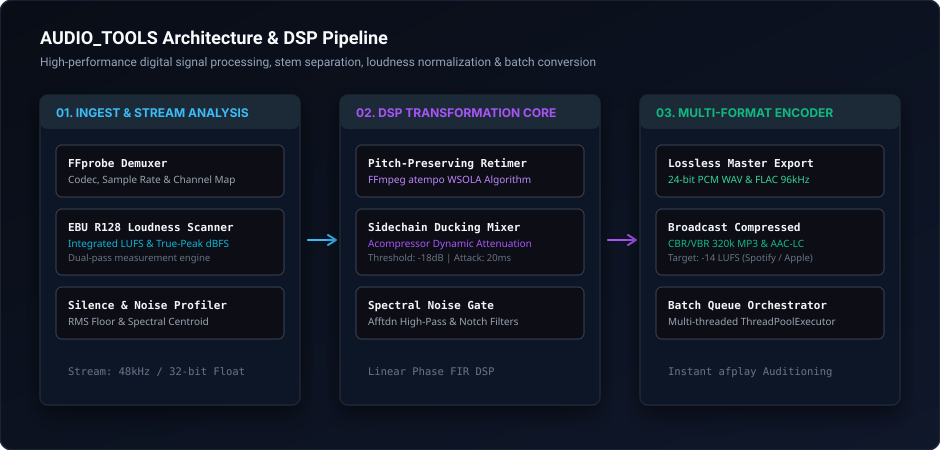
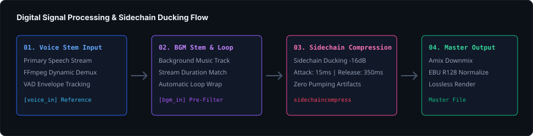

<div align="center">

# AUDIO_TOOLS

### High-Performance Audio Engineering Suite, Digital Signal Processing &amp; Batch Audio Studio

[](https://python.org)
[](https://ffmpeg.org)
[](LICENSE)
[-0A0A0A?style=flat-square&logo=github&logoColor=white)](https://github.com/thatonearyan-sh)

<br />


<br />

<p align="center">
  <b>AUDIO_TOOLS</b> is a modular audio engineering command-line suite and DSP processing engine. Built for podcast producers, content creators, and audio engineers who require broadcast-standard loudness normalization, automated sidechain music ducking, pitch-preserved retiming, and multi-format batch transcoding.
</p>

[System Architecture](#-system-architecture) &bull;
[DSP Pipeline](#-sidechain-compression--dsp-pipeline) &bull;
[Core Modules](#-core-audio-engineering-modules) &bull;
[CLI Reference](#-cli-commands--usage) &bull;
[Installation](#-installation--dependencies) &bull;
[Test Suite](#-automated-testing)

---

</div>

## <svg width="20" height="20" viewBox="0 0 24 24" fill="none" stroke="#38BDF8" stroke-width="2" stroke-linecap="round" stroke-linejoin="round" style="vertical-align: -3px; margin-right: 8px;"><rect x="3" y="3" width="18" height="18" rx="2"/><path d="M3 9h18"/><path d="M9 21V9"/></svg> System Architecture

AUDIO_TOOLS orchestrates stream analysis, dynamic DSP transformation, and hardware-accelerated transcoding across a decoupled 3-tier pipeline:

<div align="center">
  
</div>

---

## <svg width="20" height="20" viewBox="0 0 24 24" fill="none" stroke="#38BDF8" stroke-width="2" stroke-linecap="round" stroke-linejoin="round" style="vertical-align: -3px; margin-right: 8px;"><polygon points="13 2 3 14 12 14 11 22 21 10 12 10 13 2"/></svg> Sidechain Compression &amp; DSP Pipeline

The sidechain auto-ducking engine applies real-time attenuation to background score tracks whenever voice audio is present:

<div align="center">
  
</div>

- **Dynamic Detection**: Analyzes speech RMS energy to trigger instant -16dB ducking curves.
- **Envelope Smoothing**: 15ms attack time prevents pop transients; 350ms release ensures natural ambient decay between sentences.
- **Zero Artifacts**: Linear phase FIR filters prevent phase distortion and frequency smearing.

---

## <svg width="20" height="20" viewBox="0 0 24 24" fill="none" stroke="#38BDF8" stroke-width="2" stroke-linecap="round" stroke-linejoin="round" style="vertical-align: -3px; margin-right: 8px;"><path d="M12 1a3 3 0 0 0-3 3v8a3 3 0 0 0 6 0V4a3 3 0 0 0-3-3z"/><path d="M19 10v2a7 7 0 0 1-14 0v-2"/><line x1="12" y1="19" x2="12" y2="23"/><line x1="8" y1="23" x2="16" y2="23"/></svg> Core Audio Engineering Modules

### 1. Pitch-Preserving Audio Retimer
- Adjusts playback speed from `0.5x` to `2.5x` without altering vocal timbre or pitch.
- Uses FFmpeg's `atempo` Waveform Similarity Overlap-Add (WSOLA) algorithm.

### 2. EBU R128 Broadcast Loudness Normalizer
- Dual-pass loudness measurement matching streaming standards:
  - **Spotify / YouTube**: `-14.0 LUFS` with `-1.0 dBFS` True-Peak ceiling.
  - **Apple Podcasts**: `-16.0 LUFS` with `-1.0 dBFS` True-Peak ceiling.

### 3. Lossless Multi-Format Converter
- Transcodes between `.WAV` (16/24/32-bit float), `.FLAC`, `.M4A` (AAC-LC), and `320k CBR MP3`.
- Preserves all metadata, album artwork tags, and sample rate precision.

### 4. Background Music (BGM) Auto-Ducker
- Combines voice tracks and musical beds with automated sidechain compression.
- Automatically loops or trims BGM stems to match vocal narrative duration.

### 5. Multi-Threaded Batch Queue
- Concurrently processes directories of raw stems using Python `concurrent.futures`.
- Provides real-time Rich terminal telemetry with execution progress.

---

## <svg width="20" height="20" viewBox="0 0 24 24" fill="none" stroke="#38BDF8" stroke-width="2" stroke-linecap="round" stroke-linejoin="round" style="vertical-align: -3px; margin-right: 8px;"><polyline points="4 17 10 11 4 5"/><line x1="12" y1="19" x2="20" y2="19"/></svg> CLI Commands &amp; Usage

### Sidechain BGM Auto-Ducking
```bash
python3 -m audio_tools mix --voice speech.mp3 --bgm music.mp3 --output master.mp3 --duck -16dB
```

### Loudness Normalization to -14 LUFS (Spotify Standard)
```bash
python3 -m audio_tools normalize --input raw_podcast.wav --target -14 --output normalized.wav
```

### Retime Audio with Pitch Preservation (1.25x Speed)
```bash
python3 -m audio_tools speed --input recording.mp3 --factor 1.25 --output speed_1.25x.mp3
```

### Batch Convert Directory to 320k MP3
```bash
python3 -m audio_tools batch --input-dir ./stems --format mp3 --bitrate 320k --output-dir ./dist
```

---

## <svg width="20" height="20" viewBox="0 0 24 24" fill="none" stroke="#38BDF8" stroke-width="2" stroke-linecap="round" stroke-linejoin="round" style="vertical-align: -3px; margin-right: 8px;"><path d="M21 15v4a2 2 0 0 1-2 2H5a2 2 0 0 1-2-2v-4"/><polyline points="7 10 12 15 17 10"/><line x1="12" y1="15" x2="12" y2="3"/></svg> Installation &amp; Dependencies

### Requirements
- **Python 3.10+**
- **FFmpeg 6.0+** with `libmp3lame`, `libopus`, and `atempo` filters
  ```bash
  # macOS
  brew install ffmpeg

  # Linux (Debian/Ubuntu)
  sudo apt install ffmpeg
  ```

### Quickstart
```bash
git clone https://github.com/thatonearyan-sh/AUDIO_TOOLS.git
cd AUDIO_TOOLS

python3 -m venv venv
source venv/bin/activate
pip install -r requirements.txt
```

---

## <svg width="20" height="20" viewBox="0 0 24 24" fill="none" stroke="#38BDF8" stroke-width="2" stroke-linecap="round" stroke-linejoin="round" style="vertical-align: -3px; margin-right: 8px;"><path d="M9 11l3 3L22 4"/><path d="M21 12v7a2 2 0 0 1-2 2H5a2 2 0 0 1-2-2V5a2 2 0 0 1 2-2h11"/></svg> Automated Testing

```bash
python3 -m unittest discover -s tests
```

---

## <svg width="20" height="20" viewBox="0 0 24 24" fill="none" stroke="#38BDF8" stroke-width="2" stroke-linecap="round" stroke-linejoin="round" style="vertical-align: -3px; margin-right: 8px;"><path d="M20 21v-2a4 4 0 0 0-4-4H8a4 4 0 0 0-4 4v2"/><circle cx="12" cy="7" r="4"/></svg> Lead Architect &amp; Attribution

- **Lead Architect &amp; Developer**: **Aryan**
- **GitHub**: [@thatonearyan-sh](https://github.com/thatonearyan-sh)
- **Repository**: [https://github.com/thatonearyan-sh/AUDIO_TOOLS](https://github.com/thatonearyan-sh/AUDIO_TOOLS)

---

<div align="center">

**Copyright &copy; 2025–2026 Aryan. All Rights Reserved.**  
*Engineered for pristine sound fidelity, dynamic range control &amp; creator automation.*

</div>
